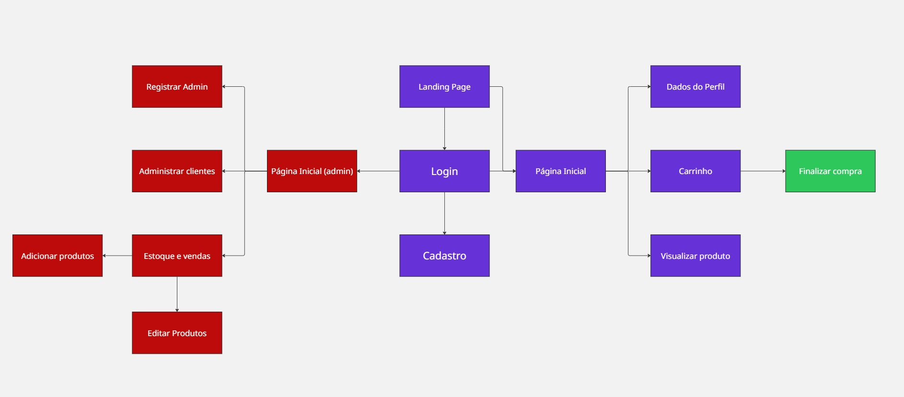

# Projeto de Web - Loja de Livros (Bibliotech)

Pedro Bizon Dania - 11812667  
Arthur Domingues Rios - 13731751  

## Requisitos do Sistema

O sistema possui dois tipos de usuário:

- Administradores: gerenciam produtos e outros administradores.  

- Clientes: acessam o sistema para realizar compras.

### Dados armazenados

- cliente: `id`, `nome`, `endereço`, `telefone`, `email`
- admin: `id`, `nome`, `telefone`, `email`
- produto: `id`, `nome`, `foto`, `descrição`, `preço`, `quantidade em estoque`, `quantidade vendida`

### Funcionalidades

- Venda de produtos: seleção de produtos, definição de quantidade, carrinho, e checkout com número de cartão (qualquer número é aceito).
- Gerenciamento (CRUD) de produtos/serviços por administradores.
- Funcionalidade específica: O cliente clica o botão "Aleatório" no cabeçalho da página e é redirecionado para um livro aleatório.


---

## Diagrama de Navegação



---

## Projeto no Figma

[Link para o Figma](https://www.figma.com/design/KCJOQ1HRQr8NRWqZ0fCD8N/Trabalho-1-Web?node-id=0-1&p=f&t=Ws5Fnwljwq0gYktq-0)

---

## Descrição do Projeto

Aplicação online para uma loja de livros com adminstradores e clientes:

Ações disponíveis para administradores:
- Área administrativa para gerenciar produtos e estoque;
- Área administrativa para gerenciar clientes;
- Criação de usuários do tipo administrador;
- Relatório de vendas;
- Editar produtos;

Ações disponíveis para clientes:
- Cadastrar e logar em uma conta;
- Buscar livros pelo título ou nome do autor;
- Colocar e remover itens do carrinho;
- Efetuar a compra dos itens do carrinho;
- Alterar os dados da sua conta;

---

## Planos de teste

Testes feitos manualmente para checar o funcionamento do projeto.
 - Teste de login: dados incorretos, faltantes e corretos
 - Teste CRUD de usuários (pelas telas de admin)
 - Teste CRUD de produtos (pelas telas de admin)
 - Teste de criação de conta
 - Teste de alteração de informações pessoais
 - Teste de compra de produtos
 - Teste de finalização de compra
 - Teste de validação das informações de endereço e pagamento na compra
 - Teste de atualização das unidades do estoque após uma compra

---

## Instalação e execução

Clone o repositório.

Frontend (localhost:5173):
- Estamos usando React + Vite + tailwindcss
```bash
npm install
```
```bash
npm run dev
```

Backend (localhost 3000):
- Estamos usando MongoDB, Axios e Cors
```bash
npm install
```
```bash
npm install axios
```
```bash
npm install cors
```
```bash
node index.js
```
#Para logar e testar o cliente:

email: teste@email.com

senha: 12345

#Para logar e testar o cliente:

email: teste@email.com

senha: 12345

#Para logar e testar admin:

email: testeadmin@email.com

senha: 12345
